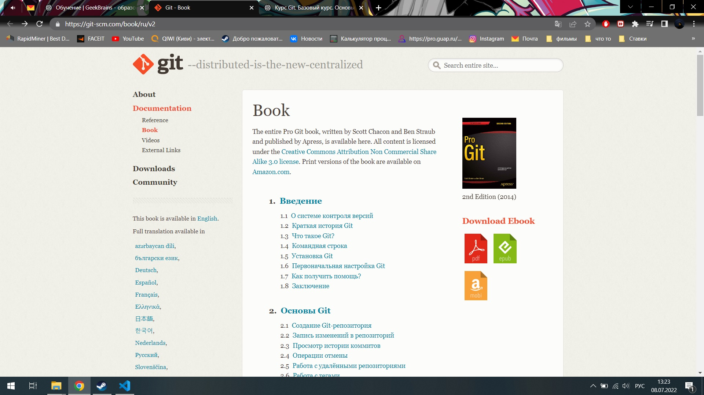

# 
  Краткий гайд по использованию Git

## 
Материалы

Для того чтобы использовать Git максимально эффективно нам потребуется воспользоваться следующими материалами:

1. 
<a href="https://git-scm.com/book/ru/v2">Книга по использованию Git</a>
 

2. 
<a href="https://gb.ru/courses/1117">Бесплатный курс от GB по использованию Git</a>

 

## 
Как начать работать?

* Скачиваем Git
* Скачиваем Visualstudio

### 
 Важно!!!

Перед началом работы вам требуется «представиться» системе контроля версий. Это нужно сделать всего один раз, и git запомнит вас. Для этого нужно ввести в терминале 2 команды:
1. `git config --global user.name «Ваше имя англ буквами»`
2. `git config --global user.email ваша_почта@example.com`

## 
Основные команды

<body>
  <table border="1">
   <tr>
    <th>Начало команды</th>
    <th>Конец команды</th>
    <th>Значение команды</th>
   </tr>
   <tr>
    <td>git</td>
    <td>add "Название файла"</td>
    <td>Сохраняет/добавляет наш файл</td>
  </tr>
  <tr>
    <td>git</td>
    <td>log</td>
    <td>Выводит журнал изменений </td>
  </tr>
  <tr>
    <td>git</td>
    <td>commit -m " "</td>
    <td>Сохраняет изменения </td>
  </tr>
  <tr>
    <td>git</td>
    <td>checkout</td>
    <td>Команда для возврата к прошлому сохранению</td>
  </tr>
  <tr>
    <td>git</td>
    <td>checkout master</td>
    <td>Возврат к актуальному состоянию</td>
  </tr>
   <tr>
    <td>git</td>
    <td>diff</td>
    <td>Показывает разницу между текущим файлом и сохраненным</td>
  </tr>
     <tr>
    <td>git</td>
    <td>init</td>
    <td>Инициализация</td>
  </tr>
       <tr>
    <td>git</td>
    <td>status</td>
    <td>Показывает сохранен наш файл или нет</td>
  </tr>
 </table>
 </body>

