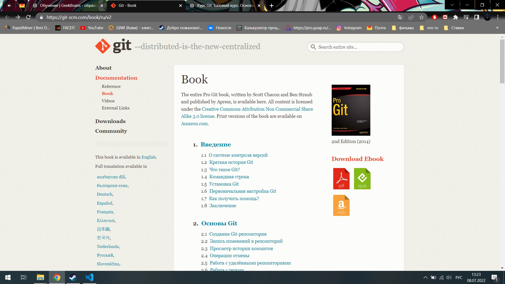

# Инструкция

<<<<<<< HEAD
## Выделение текста

Для курсива нам потребуются звездочки или нижнее подчеркивание(__), например: *вот так* или _вот так_

Для полужирного потребуется две звездочки или двойное подчеркивание : **вот так** или __вот так__

Альтернативные способы выделения текста жирным или курсивом нужны для того чтобы мы могли совмещать оба этих способа, например _текст может быть выделен курсивом и при этом быть **полужирным**_

## Изображения 

чтобы вставить изображение в текст следует сделать следующее: 

Текст для проверки чего то там 

## Выделение текста

Для курсива нам потребуются звездочки или нижнее подчеркивание(__), например: *вот так* или _вот так_

Для полужирного потребуется две звездочки или двойное подчеркивание : **вот так** или __вот так__

Альтернативные способы выделения текста жирным или курсивом нужны для того чтобы мы могли совмещать оба этих способа, например _текст может быть выделен курсивом и при этом быть **полужирным**_
=======
## Списки 

Чтобы добавить ненумерованные списки, необходимо пункты выделить звездочкой:
* Так
* Вот так
* И вот так

Чтобы добавить нумерованные списки необходимо просто пронумеровать пункты:
1. Первый
2. Второй
3. Третий 
>>>>>>> list
